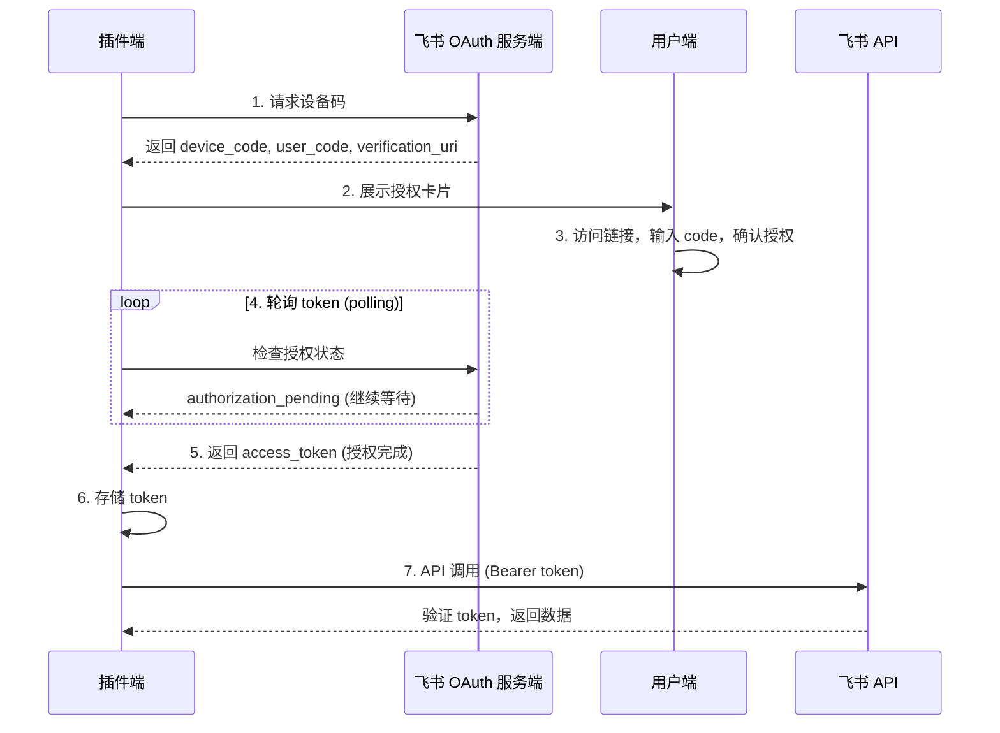

# UAT 用户访问令牌（User Access Token）获取流程

本文档详细说明飞书插件中 UAT（User Access Token）的获取、存储、刷新和使用流程。

## 概述

UAT（User Access Token）是用户级别的访问令牌，用于代表用户调用飞书 API。与应用级别的 Tenant Token 不同，UAT 只能访问用户有权限的资源。

## OAuth 2.0 Device Flow

飞书插件使用 **OAuth 2.0 Device Authorization Grant**（RFC 8628）获取 UAT。这种授权模式适用于输入能力受限的设备，用户需要在另一个设备上完成授权。

### 授权流程



## 核心代码文件

| 文件 | 作用 |
|------|------|
| `src/core/device-flow.js` | Device Flow 实现（请求设备码、轮询 token） |
| `src/core/token-store.js` | Token 存储（Keychain/加密文件） |
| `src/core/uat-client.js` | UAT 获取和自动刷新 |
| `src/tools/oauth.js` | OAuth 工具（发起授权流程） |
| `src/tools/oauth-cards.js` | 授权卡片 UI 构建 |
| `src/tools/auto-auth.js` | 自动授权拦截器 |

## 详细流程说明

### 步骤 1：请求设备授权码

**文件**: `src/core/device-flow.js:requestDeviceAuthorization()`

```javascript
export async function requestDeviceAuthorization(params) {
    const { appId, appSecret, brand } = params;
    const endpoints = resolveOAuthEndpoints(brand);

    // 构建请求
    const basicAuth = Buffer.from(`${appId}:${appSecret}`).toString('base64');
    const body = new URLSearchParams();
    body.set('client_id', appId);
    body.set('scope', scope);

    // 调用设备授权端点
    const resp = await feishuFetch(endpoints.deviceAuthorization, {
        method: 'POST',
        headers: {
            'Content-Type': 'application/x-www-form-urlencoded',
            Authorization: `Basic ${basicAuth}`,
        },
        body: body.toString(),
    });

    // 返回设备码信息
    return {
        deviceCode: data.device_code,
        userCode: data.user_code,
        verificationUri: data.verification_uri,
        verificationUriComplete: data.verification_uri_complete,
        expiresIn: data.expires_in ?? 240,  // 默认 4 分钟
        interval: data.interval ?? 5,       // 默认 5 秒轮询
    };
}
```

**端点**:
- 飞书：`https://accounts.feishu.cn/oauth/v1/device_authorization`
- Lark：`https://accounts.larksuite.com/oauth/v1/device_authorization`

**返回参数**:
| 参数 | 说明 |
|------|------|
| `device_code` | 设备码，用于轮询 token |
| `user_code` | 用户验证码，需在授权页面输入 |
| `verification_uri` | 授权页面 URL |
| `verification_uri_complete` | 完整授权链接（含 user_code） |
| `expires_in` | 设备码有效期（秒），默认 240 秒 |
| `interval` | 轮询间隔（秒），默认 5 秒 |

### 步骤 2：轮询获取 Token

**文件**: `src/core/device-flow.js:pollDeviceToken()`

```javascript
export async function pollDeviceToken(params) {
    const { appId, appSecret, brand, deviceCode, expiresIn, signal } = params;
    const endpoints = resolveOAuthEndpoints(brand);
    const deadline = Date.now() + expiresIn * 1000;

    while (Date.now() < deadline) {
        // 等待间隔时间
        await sleep(interval * 1000, signal);

        // 请求 token
        const resp = await feishuFetch(endpoints.token, {
            method: 'POST',
            body: new URLSearchParams({
                grant_type: 'urn:ietf:params:oauth:grant-type:device_code',
                device_code: deviceCode,
                client_id: appId,
                client_secret: appSecret,
            }).toString(),
        });

        // 处理响应
        switch (data.error) {
            case 'authorization_pending':
                // 用户尚未完成授权，继续轮询
                continue;
            case 'slow_down':
                // 服务端要求降低轮询频率
                interval += 5;
                continue;
            case 'access_denied':
                // 用户拒绝了授权
                return { ok: false, error: 'access_denied' };
            case 'expired_token':
                // 设备码已过期
                return { ok: false, error: 'expired_token' };
            default:
                if (data.access_token) {
                    // 授权成功，返回 token
                    return { ok: true, token: { ...data } };
                }
        }
    }
}
```

**端点**:
- 飞书：`https://open.feishu.cn/open-apis/authen/v2/oauth/token`
- Lark：`https://open.larksuite.com/open-apis/authen/v2/oauth/token`

**轮询状态码**:
| 错误码 | 说明 | 处理方式 |
|--------|------|----------|
| `authorization_pending` | 用户尚未完成授权 | 继续轮询 |
| `slow_down` | 轮询过快 | 间隔 +5 秒，继续轮询 |
| `access_denied` | 用户拒绝授权 | 终止，报错 |
| `expired_token` | 设备码过期 | 终止，重新发起 |

### 步骤 3：存储 Token

**文件**: `src/core/token-store.js:setStoredToken()`

Token 存储在操作系统的凭证管理服务中：

| 平台 | 存储方式 |
|------|----------|
| macOS | Keychain Access (`security` CLI) |
| Linux | AES-256-GCM 加密文件（`~/.local/share/openclaw-feishu-uat/`） |
| Windows | AES-256-GCM 加密文件（`%LOCALAPPDATA%\openclaw-feishu-uat\`） |

```javascript
export async function setStoredToken(token) {
    const key = accountKey(token.appId, token.userOpenId);
    const payload = JSON.stringify(token);
    await backend.set(KEYCHAIN_SERVICE, key, payload);
}
```

**存储结构** (`StoredUAToken`):
```typescript
{
    userOpenId: string;      // 用户 open_id
    appId: string;           // 应用 ID
    accessToken: string;     // 访问令牌
    refreshToken: string;    // 刷新令牌
    expiresAt: number;       // access_token 过期时间戳 (ms)
    refreshExpiresAt: number;// refresh_token 过期时间戳 (ms)
    scope: string;           // 授权 scope，空格分隔
    grantedAt: number;       // 授权时间戳 (ms)
}
```

### 步骤 4：获取有效 Token

**文件**: `src/core/uat-client.js:getValidAccessToken()`

```javascript
export async function getValidAccessToken(opts) {
    const stored = await getStoredToken(opts.appId, opts.userOpenId);
    if (!stored) {
        throw new NeedAuthorizationError(opts.userOpenId);
    }

    const status = tokenStatus(stored);
    if (status === 'valid') {
        return stored.accessToken;
    }

    if (status === 'needs_refresh') {
        // Token 即将过期，主动刷新
        const refreshed = await refreshWithLock(opts, stored);
        if (!refreshed) {
            throw new NeedAuthorizationError(opts.userOpenId);
        }
        return refreshed.accessToken;
    }

    // Token 已过期，需要重新授权
    await removeStoredToken(opts.appId, opts.userOpenId);
    throw new NeedAuthorizationError(opts.userOpenId);
}
```

**Token 状态判断** (`src/core/token-store.js:tokenStatus()`):
```javascript
const REFRESH_AHEAD_MS = 5 * 60 * 1000; // 提前 5 分钟刷新

export function tokenStatus(token) {
    const now = Date.now();
    if (now < token.expiresAt - REFRESH_AHEAD_MS) {
        return 'valid';         // 有效
    }
    if (now < token.refreshExpiresAt) {
        return 'needs_refresh'; // 需刷新
    }
    return 'expired';           // 已过期
}
```

### 步骤 5：Token 刷新

**文件**: `src/core/uat-client.js:doRefreshToken()`

```javascript
async function doRefreshToken(opts, stored) {
    const endpoints = resolveOAuthEndpoints(opts.domain);
    const resp = await feishuFetch(endpoints.token, {
        method: 'POST',
        body: new URLSearchParams({
            grant_type: 'refresh_token',
            refresh_token: stored.refreshToken,
            client_id: appId,
            client_secret: appSecret,
        }).toString(),
    });

    const data = await resp.json();
    if (data.code !== 0 || data.error) {
        // 刷新失败，可能需要重新授权
        return null;
    }

    // 更新存储的 token
    const updated = {
        ...stored,
        accessToken: data.access_token,
        refreshToken: data.refresh_token ?? stored.refreshToken,
        expiresAt: now + data.expires_in * 1000,
        refreshExpiresAt: now + data.refresh_token_expires_in * 1000,
    };
    await setStoredToken(updated);
    return updated;
}
```

**注意**: `refresh_token` 是一次性的，每次刷新后会返回新的 `refresh_token`。

## 授权发起方式

### 方式 1：自动授权（推荐）

**文件**: `src/tools/auto-auth.js`

当工具调用因权限不足失败时，自动触发授权流程：

```javascript
export async function handleInvokeErrorWithAutoAuth(err, config) {
    if (err instanceof NeedAuthorizationError) {
        // 自动发起授权
        return await executeAuthorize({
            senderOpenId: err.userOpenId,
            scope: err.requiredScope,
        });
    }
    throw err;
}
```

### 方式 2：手动授权命令

用户在飞书中发送消息：

```
/feishu auth
```

触发 `feishu_oauth` 工具的 `authorize` action。

## 身份验证

**文件**: `src/tools/oauth.js:verifyTokenIdentity()`

防止群聊中其他用户点击授权链接后，错误的 UAT 被绑定到 owner 的身份：

```javascript
async function verifyTokenIdentity(brand, accessToken, expectedOpenId) {
    const url = `${domain}/open-apis/authen/v1/user_info`;
    const res = await fetch(url, {
        headers: { Authorization: `Bearer ${accessToken}` },
    });
    const data = await res.json();

    // 验证 actual open_id 是否与 expected 一致
    return {
        valid: data.data?.open_id === expectedOpenId,
        actualOpenId: data.data?.open_id,
    };
}
```

## 错误处理

### NeedAuthorizationError

当用户未授权或 token 过期时抛出：

```javascript
throw new NeedAuthorizationError(userOpenId);
```

**处理方式**:
1. 捕获异常
2. 发起 Device Flow 授权
3. 等待用户完成授权
4. 重试原操作

### Token 刷新失败

| 错误码 | 说明 | 处理 |
|--------|------|------|
| `invalid_grant` | refresh_token 无效 | 清除 token，重新授权 |
| `expired_token` | refresh_token 过期 | 清除 token，重新授权 |
| 其他错误 | 网络错误等 | 重试或报错 |

## 安全说明

1. **Token 不暴露**: UAT 的值永远不会暴露给 AI 层，只在后端使用
2. **Owner 检查**: 只有应用所有者才能发起授权（`src/core/owner-policy.js`）
3. **身份验证**: 授权完成后验证实际授权用户与发起人一致
4. **加密存储**: Token 在本地使用 OS 原生的凭证服务加密存储
5. **自动刷新**: 支持 `offline_access` scope，token 可自动刷新

## 相关文档

- [MCP Doc 架构说明](./mcp-doc-architecture.md) - MCP 工具如何使用 UAT
- [故障排查案例](../TROUBLESHOOTING.md) - Token 需刷新等问题的解决方案
- [OAuth 2.0 Device Flow RFC](https://datatracker.ietf.org/doc/html/rfc8628)
